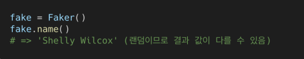
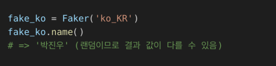
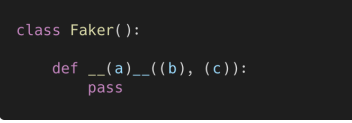
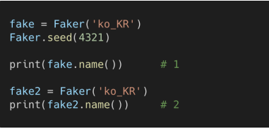

## 1. pip

아래 명령어는 (1) 무엇을 위한 명령인지 (2) 실행은 어디에서 해야하는지 작성 하시오.


```
1. faker 패키지 설치 명령
2. 커맨드 창
```


## 2. Basic Usages(https://github.com/joke2k/faker#basic-usage)

Faker는 다양한 메서드를 통해 임의의 결과값을 반환해준다. 임의의 영문 이름을 반환하는 아래 코드에서 라인별 의미를 주석을 참고하여 작성하시오.


```
1. faker 모듈 내의 Faker 함수를 import
3, name()은 fake의 method 이다.
```

## 3. Localization(https://github.com/joke2k/faker#localization)

Faker는 다양한 언어의 Locale을 지원한다. 

1. 인자 없이 호출 시에는 영문이 기본 설정이다. (en_US)



2. Locale 정보를 포함하여 호출 시에는 해당 언어 설정을 따른다.



직접 해당하는 기능을 구현한다고 하였을 때, 빈칸 (a), (b), (c)에 들어갈 코드로 적절한 것을 작성하시오. **(힌트: 생성자 메서드와 함수의 개념)**



```python
def __init__(self, name):
    pass
```

## 4. Seeding the Generator(https://github.com/joke2k/faker#seeding-the-generator)

컴퓨터 프로그래밍에서 임의의 값을 반환하는 경우(난수 생성 등) 시드라는 개념이 있다. 시드를 설정하게 되면 동일한 순서로 난수를 발생시킬 수 있어 일반적으로 디버깅을 위하여 활용 된다.


아래의 코드를 실행 했을 때, #1과 #2에서 출력되는 결과를 각각 작성하고, seed()는 어떤 종류의 메서드인지 작성하시오.



```
이도윤 # 1
이지후 # 2
# seed 는 Faker 의 random을 여러번 실행해도 동일한 값으로 출력해주지만 각 객체들은 다름
```


seed()와 seed_instance()는 각각 어떠한 용도로 쓰일 수 있는지 작성하시오

```
```

