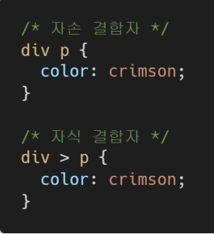

### 1. Semantic Tag

보기 중 콘텐츠의 의미를 명확히 하기 위해 HTML5에서 새롭게 추가된 시맨틱(semantic)  태그를 모두 고르시오.

```
(보기)
header, section, footer, div, h1, a, form, span      # 맨 앞 3개 정답
```

### 2. input Tag

```html
<form>
    <label for="username">USERNAME : </label>
    <input type="text" id="username" placeholder="입력해주세요">
    
    
    <input type="submit" value="로그인">
</form>
```

### 3. 크기 단위

크기 단위 em은 요소에 지정된 상속된 사이즈나 기본 사이즈에 대해 상대적인 사이즈를 설정한다. 즉, 상속의 영향으로 사이즈가 의도치 않게 변경될 수 있는데 이를 예방하기 위해 HTML 최상위 요소의 사이즈를 기준으로 삼는 크기 단위는 무엇인가?

```
rem
```

### 4. 선택자

다음 예제를 통해 ‘자손 결합자’와 ‘자식 결합자’의 차이를 설명하시오.



```
자손 -> 모든 p
자식 -> 바로 p 하나
```