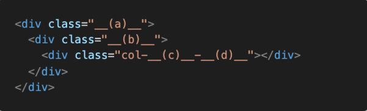

### 1 . CSS flex-direction

Flex box의 주축을 변경하는 flex-direction의 4가지 값과 각각의 특징을 작성하시오.

```
row : 가로
row-reverse : 가로 리버스
column : 세로
column-reverse : 세로 리버스
```

### 2. Bootstrap flex-direction

flex-direction의 4가지 요소와 대응하는 bootstrap 클래스를 작성하시오.

```
justify-content / align-items
```

### 3. align-items

align-items 속성의 4가지 값과 각각의 특징을 작성하시오.

```
stretch : 전체 공간 활용
center : 중앙 정렬
start : 위쪽 정렬
end : 아래족 정렬
```

### 4. flex-flow

flex-flow 속성은 두가지 속성의 축약형이다. 올바르게 짝지어진 것을 고르시오.

```
(1) flex-direction, flex-wrap		<-----------  정답!
(2) flex-direction, align-items
(3) justify-content, flex-wrap
(4) justify-content, align-items
```

### 5. Bootstrap Grid System

하단 코드에 Bootstrap Grid System을 적용시키고자 할 때, __(a)__, __(b)__ 각각에 입력해야 할 클래스 이름을 작성하시오.



```
(a) : container
(b) : row
```

### 6. Breakpoint prefix

Bootstrap Grid System에서 요소의 크기를 지정하기 위해서는 상단 코드와 같은 형태로 클래스 이름을 지정해야 한다.

__(c)__에 들어갈 수 있는 값과 그 값들이 가지는 의미를 작성하시오. 

__(d)__에 들어갈 수 있는 값과 그 값들이 가지는 의미를 작성하시오

```
(c) : (sm, md, lg, xl, xxl), 창 크기 변화에 따른 컬럼 갯수 조절가능
(d) : (0 ~ 12) 한 로우가 12칸이라서 크기에 따라 분배가능
```
