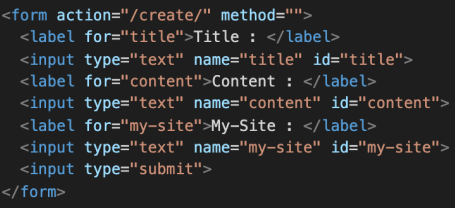

### 1. 한국어로 번역하기

1-1. django 프로젝트를 한국어로 제공하기 위해 번역이 필요하다. 이 설정을 위해 settings.py에 어떤 변수 그리고 어떤 값을 할당해야 하는지 작성하시오.

```python
LANGUAGE_CODE = 'ko-kr'
```

1-2 추가로 settings.py에 ‘이 변수‘가 활성화인 상태여야 1-1번 변수를 설정할 수 있다고 한 다. ‘이 변수’는 무엇인가?’

```
USE_I18N = True -> 장고 번역 시스템 활성화 여부 (answer)
USE_L10N = True -> 현지화 데이터 형식 사용 여부
USE_TZ = True -> 시간대 인식 여부
```

---

### 2. 경로 설정하기

다음은 어떤 django 프로젝트의 urls.py의 모습이다. 주소 ’/ssafy’로 요청이 들어왔을 때 실 행되는 함수가 pages 앱의 views.py 파일 안 ssafy 함수라면, 요청에 응답하기 위해 빈칸 __(a)__에 추가되어야 할 코드를 작성하시오.


```
'ssafy/', views.ssafy
```

---

### 3. Django Template Language

아래 링크를 참고하여 각 문제들을 해결하기 위한 코드를 작성하시오. 

https://docs.djangoproject.com/en/3.2/ref/templates/builtins/


1) menus 리스트를 반복문으로 출력하시오.

```django

	<p>{{ menu }}</p>

```

2. posts 리스트를 반복문을 활용하여 0번 글부터 출력하시오.

```django

	<p>{{ forloop.counter0 }}번 글 : {{ post }}</p>

```

3. users 리스트가 비어있다면 **현재 가입한 유저가 없습니다.** 텍스트를 출력하시오.

```django

	<p>{{ user }}</p>

	<p>현재 가입한 유저가 없습니다.</p>

```

4. 첫 번째 반복문일 때와 아닐 때를 조건문으로 분기처리 하시오.

```django

	<p>첫 번째 반복문 입니다.</p>

<p>첫 번째 반복문이 아닙니다.</p>

```

5. 출력된 결과가 주석과 같아지도록 하시오.

```django
<!-- 5-->
<p>{{ 'hello'|length }}</p>
<!-- My Name Is Tom -->
<p>{{ 'my name is tom'|title }}</p>
```

6. 변수 today에 datetime 객체가 들어있을 때 출력된 결과가 주석과 같아지도록 작성하시오.

```django
<!-- 2020년 02월 02일 (Sun) PM 02:02 -->
{{ today|date:'Y년 m월 d일 (D) A h:i'}}
```

---

### 4. Form tag with Django



1) 지문의 코드 중 form 태그의 속성인 action의 역할에 대해 설명하시오.

```
입력 데이터가 전송될 URL 지정
```

2) 지문의 코드 중 method가 가질 수 있는 속성 값을 작성하시오.

```
text, button, checkbox, file, hidden, image, password, radio, reset, submit
```

3) input 태그에 각각 `안녕하세요`, `반갑습니다`, `파이팅` 문자열을 넣고 submit 버튼을 눌렀을 때 이동하는 url 경로를 작성하시오

```
/create/?title=안녕하세요&content=반갑습니다&my_site=파이팅
```
