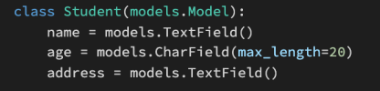

### 1. 아래의 설명을 읽고 T/F 여부를 작성 후 이유를 설명하시오.

- URI는 정보의 자원을 표현하고, 자원에 대한 행위는 HTTP Method 로 표현한다.    `(O)`
- HTTP Method는 GET과 POST 두 종류 뿐이다. `(X) PUT, DELETE 있음`
- `https://www.fifa.com/worldcup/teams/team/43822/create/`는 계층 관계를 잘 표현한 RESTful한 URI라고 할 수 있다.    `(O)`


---

### 2. 다음의 HTTP stauts code의 의미를 간략하게 작성하시오.

- 200 : `OK`  요청이 성공적으로 되었습니다. 정보는 요청에 따른 응답으로 반환됩니다.
- 400 : `Bad Request`   이 응답은 잘못된 문법으로 인하여 서버가 요청하여 이해할 수 없음을 의미합니다.
- 401 : `Unauthorized`   비록 HTTP 표준에서는 '미승인(unauthorized)'를 명확히 하고 있지만, 의미상 이 응답은 '비인증(unauthenticated)'를 의미합니다. 클라이언트는 요청한 응답을 받기 우해서는 반드시 스스로를 인증해야 합니다.
- 403 : `Forbidden`   클라이언트는 콘텐츠의 접근할 권리를 가지고 있지 않습니다 예를 들어, 그들은 미승인이어서 서버는 거절을 위한 적절한 응답을 보냅니다. 401과 다른 점은 서버가 클라이언트가 누구인지 알고 있습니다.
- 404 : `Not Found`   서버는 요청받은 리소르를 찾을 수 없습니다. 브라우저에서는 알려지지 않은 URL을 의미합니다. 이것은 API에서 종점은 적절하지만 리소스 자체는 존재하지 않음을 의미할 수 있습니다. 서버들은 인증받지 않은 클라이언트로부터 리소스를 숨기기 위하여 이 응답을 403 대신에 전송할 수도 있습니다. 이 응답코드는 웹에서 반복적으로 발생하기 때문에 가장 유명할지도 모릅니다.
- 500 : `Internal Server Error`   웹 사이트 서버에 문제가 있음을 의미하지만 서버는 정확한 문제에 대해 더 구체적으로 설명할 수 없습니다.


---

### 3. 아래의 모델을 바탕으로 ModelSerializer인 StudentSerializer class를 작성하시오.




```python
# serializers.py
from rest_framework import serializers
from .Model import Student

class StudentSerializer(serializers.ModelSerializer):
    
    class Meta:
        model = Student
        fields = '__all__'
```


---

### 4. Serializers의 의미를 DRF(Django REST Framework) [공식 문서](https://www.django-rest-framework.org/)를 참고하여 간단하게 설명하시오.

> Serializers allow complex data such as querysets and model instances to be converted to native Python datatypes that can then be easily rendered into `JSON`, `XML` or other content types. Serializers also provide deserialization, allowing parsed data to be converted back into complex types, after first validating the incoming data.

---

> 복잡한 데이터를 Python 데이터형으로 변환하여 JSON, XML 등으로 쉽게 렌더링 가능하게 한다.