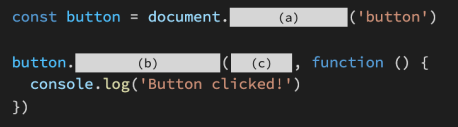

### 1. 아래의 설명을 읽고 T/F 여부를 작성하시오.

- EventTarget.addEventListener(type, listener)에서 listener 위치에 콜백 함수를 정의한 다. 이때 콜백 함수의 첫 번째 매개변수에는 발생한 이벤트에 대한 정보를 담고 있는 Event 객체가 전달된다.    `(O)`
- event.preventDefault 메서드를 통해 이벤트의 기본 동작을 취소할 수 있다    `(O)`


---

### 2. DOM Event에는 다양한 종류의 Event가 존재한다.  아래 제시된 Event들이 각각 어떤 시점에 발생하는지 다음 [MDN 문서](https://developer.mozilla.org/ko/docs/Web/Events)를 참고하여 간단하게 작성하시오.

```
click, mouseover, mouseout, keydown, keyup, load, scroll, change, input
```

- `click` : 포인팅 장치 버튼이 엘리먼트에서 눌렸다가 놓였을 때
- `mouseover` : 포인팅 장치가 리스너가 등록된 엘리먼트나 그 자식 엘리먼트의 위로 이동했을 때
- `mouseout` : 포인팅 장치가 리스너아 등록된 엘리먼트 또는 그 자식 엘리먼트의 밖으로 이동했을 때
- `keydown` : 키가 눌렸을 때
- `keyup` : 키 누름이 해제될 때
- `load` : 진행이 성공했을 때
- `scroll` : 다큐먼트 뷰나 엘리먼트가 스크롤되었을 때
- `change` : 요소의 값을 변경할 때
- `input` : 입력 요소가 변경될 때


---

### 3. 다음은 버튼을 클릭했을 때, 콘솔창을 통해 메시지를 확인하는 코드이다.



```
(a) = querySelector
(b) = addEventListener
(c) = 'click'
```

