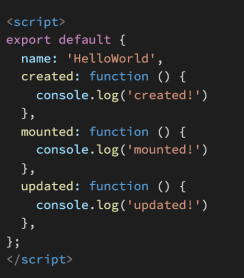

### 1. 아래의 설명을 읽고 T/F 여부를 작성하시오.

- Vue의 Life Cycle Hook에서 created Hook은 Vue template에 작성한 요소들이 DOM에 모두 그려지는 시점에 실행된다.	`(X) DOM에 추가되기 전`
- npm은 Node Package Manager의 약자이며, npm을 통해 설치한 package 목록은 package.json 파일에 자동으로 작성된다.    `(O)`
- Vue CLI를 통해 만든 프로젝트는 브라우저가 아닌 node.js 환경이기 때문에 DOM 조작이나 Web API 호출 등 Vanilla JS에서의 기능을 사용할 수 없다.    `(X)`


---

### 2. Vue Router에서 설정하는 history mode가 무엇을 뜻하는지 서술하시오.

```
vue-router의 기본 모드는 hash mode이다. URL해시를 사용하여 전체 URL을 시뮬레이트하므로 URL이 변경될 때 페이지가 다시 로드되지 않는다.
해시를 제거하기 위해 history모드를 사용하는데, history.pushState API를 활용하여 페이지를 다시 로드하지 않고도 URL 탐색을 할 수 있습니다.
```


---

### 3. Vue Life Cycle Hook을 참고하여, 다음 Vue application을 실행했을 때, console 창에 출력되는 메시지를 작성하시오.



```
created!
mounted!
```

