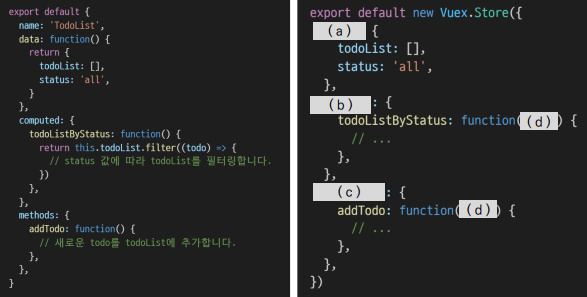

### 1. 아래의 설명을 읽고 T/F 여부를 작성하시오.

- Vue 프로젝트에서 상태 관리를 하기 위해서는 반드시 Vuex를 설치해야 한다.    `(X)`
- mutations는 반드시 state를 수정하기 위해서만 사용되어야 한다.    `(O)`
- mutations는 store.dispatch로, actions는 store.commit으로 호출할 수 있다.    `(x) 바뀜`
- state는 data의 역할, getters는 computed와 유사한 역할을 담당한다.    `(O)`


---

### 2. Vuex에서 State, Getters, Mutations, Actions의 역할을 각각 서술하시오.

```
State : 변수들의 집합
getters : state의 변수들을 get하는 역할
mutations : 변수 조작 함수들의 집합
actions : 비동기 처리 함수들의 집합
```


---

### 3. 컴포넌트에 작성된 Todo App 관련 코드를 Vuex의 Store로 옮기고자 한다.



```
(a) : state
(b) : getters
(c) : mutations
(d) : state
```

