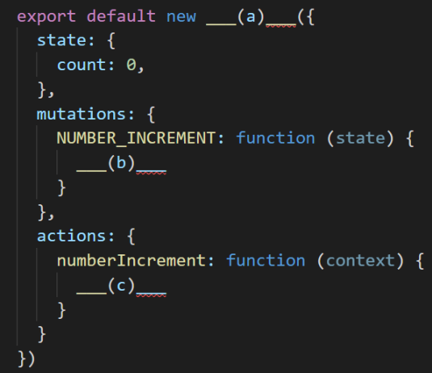
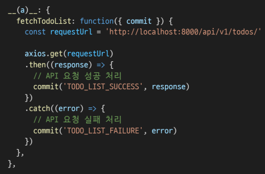
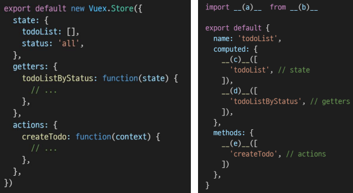

### 1. 다음은 Vuex로 구성된 하나의 숫자를 counting하는 store이다.

- NUMBER_INCREMENT mutation handler가 호출되면 state의 count를 1만큼 증가시킨다.

  

```
(a) : Vuex.Store
(b) : state.count++
(c) : context.commit('NUMBER_INCREMENT')
```


---

### 2. 아래 예시의 함수는 서버로부터 데이터를 가져 온 뒤,  응답 값을 state에 저장하기 위하여 mutations를 호출하는 로직을 수행한다. 이와 같이 비동기 API 및 mutations 호출에 적합한 store의 속성 (a)를 작성하시오.



```
(a) : actions
```


---

### 3. 왼쪽처럼 store에 state, getters, actions가 정의되어 있다. “Component Binding Helpers”를 통해 각 컴포넌트에서 사용하고자 한다. [Vuex 공식문서]([API 레퍼런스 | Vuex (vuejs.org)](https://v3.vuex.vuejs.org/kr/api/#컴포넌트-바인딩-헬퍼))를 참고



```
(a) : { mapState, mapGetters, mapActions }
(b) : 'vuex'
(c) : ...mapState
(d) : ...mapGetters
(e) : ...mapActions
```


---

### 4. store에 정의한 state를 직접 변경하지 않고, mutations를 통해 변경해야 하는 이유를 [Vuex 공식문서]([Vuex가 무엇인가요? | Vuex (vuejs.org)](https://v3.vuex.vuejs.org/kr/))를 참고하여 작성하시오

```
Mutation은 동기적 처리여야 한다. -> 만약 비동기라면 상태 변경이 예측 불가능해진다.
Action은 비동기 처리로 commit 으로 Mutation으로 요청 보내지만 dispatch 메소드는 Promise를 반환하기 때문에 처리의 순서를 제어할 수 있다.
```

