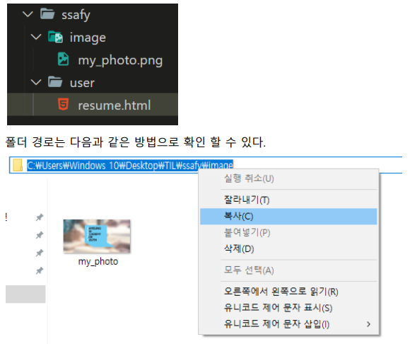
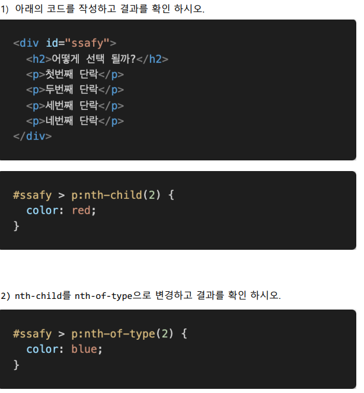

### 1. img tag

아래 그림과 같은 폴더 구조가 있다. resume.html에서 코드를 작성 중일 때, image  폴더 안의 my_photo.png를 보여주는  tag를 작성하시오.  단, 이미지가 제대로 출력되지 않을 때는 ssafy 문자열이 출력 되도록 작성하시오.



```html

```

### 2. 파일 경로

위와 같이 경로를 __(a)__로 작성 할 시, github에 업로드 하거나 전체 폴더의 위치가 변경 되었을 때 이미지를 불러 올 수 없게 된다. 이를 해결 하려면 이미지 경로를 __(b)__ 로 바꾸어 작성하면 된다.

```
(a) - 절대경로
(b) - 상대경로
```

### 3. Hyper Link

출력된 my_photo.png 이미지를 클릭하면 ssafy.com으로 이동하도록 하시오.

```html
<a href="https://ssafy.com">
  
</a>
```

### 4. 선택자



3) 작성한 코드를 참고하여 nth-child()와 nth-of-type()의 차이점을 작성하시오

```
nth-child(N)는 부모 안에 모든 요소 중 N번째 요소를 가리키고, A:nth-of-type(N)는 부모안에 A라는 요소중 N번째 요소를 가리킨다

nth-child : 부모 엘리먼트의 모든 자식 엘리먼트중 n번째     # 첫번째 단락 색칠

nth-of-type : 부모 엘리먼트의 특정 자식 엘리먼트중 n번째         # 두번째 단락 색칠
```